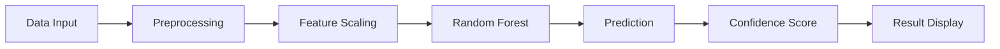

# ❤️ Heart Disease Prediction App

<div align="center">
  
[](https://www.python.org/downloads/)
[](https://streamlit.io/)
[](https://scikit-learn.org/)
[](LICENSE)

**🩺 An AI-Powered Heart Disease Risk Assessment Tool**

*Empowering early detection through machine learning*

[🚀 Live Demo](#-quick-start) • [📊 Features](#-features) • [🔬 Model Performance](#-model-performance) • [📖 Documentation](#-documentation)

</div>

---

## 🌟 Overview

The **Heart Disease Prediction App** is a comprehensive machine learning application that predicts heart disease risk using a Random Forest Classifier with hyperparameter optimization. Built with Streamlit, it provides medical professionals and researchers with an intuitive tool for early heart disease screening.

### 🎯 Why This App?

* **🔬 Scientific Approach**: Based on UCI Heart Disease Dataset with rigorous ML methodology
* **⚡ Real-time Predictions**: Instant risk assessment with confidence scores
* **📊 Comprehensive Analysis**: Detailed model performance metrics and comparisons
* **🎨 User-Friendly Interface**: Interactive Streamlit dashboard for easy use
* **🔍 Transparent AI**: Feature importance analysis and model explainability

---

## 🚀 Model Performance

<div align="center">

| Metric | Score | Status |
|--------|-------|--------|
| **Cross-Validation ROC-AUC** | `0.913` | ✅ Excellent |
| **Test ROC-AUC** | `0.899` | ✅ Very Good |
| **Test Accuracy** | `81%` | ✅ Good |
| **Recall (Disease Detection)** | `87%` | ✅ High Sensitivity |

</div>

### 📈 Model Comparison Results

Our Random Forest model was selected after comparing 4 different algorithms:

| Algorithm | CV ROC-AUC | Test ROC-AUC | Test Accuracy | Status |
|-----------|------------|--------------|---------------|--------|
| **Random Forest** | 0.913 | **0.899** | 0.81 | ✅ **Selected** |
| MLP Classifier | 0.928 | 0.896 | 0.84 | ❌ Not Selected |
| Logistic Regression | 0.927 | 0.882 | 0.84 | ❌ Not Selected |
| Decision Tree | 0.852 | 0.833 | 0.75 | ❌ Not Selected |

> **Why Random Forest?** Best test ROC-AUC performance (0.899) indicating superior generalization capability.

---

## ✨ Features

### 🎨 Interactive Web Interface
* **Real-time Predictions**: Instant heart disease risk assessment
* **Confidence Scoring**: Probability distributions with confidence levels
* **Visual Analytics**: Interactive charts and probability visualizations
* **Parameter Input**: User-friendly sidebar controls

### 📊 Advanced Analytics
* **Model Comparison**: Performance analysis across 4 ML algorithms
* **Feature Importance**: Visual analysis of key health indicators
* **ROC Curve Analysis**: Interactive ROC-AUC comparisons
* **Detailed Metrics**: Comprehensive performance evaluation

### 🔬 Clinical Integration
* **Medical Context**: Features selected based on clinical significance
* **Risk Interpretation**: Clear explanations of prediction results
* **Confidence Levels**: High/Medium/Low confidence indicators
* **Professional Disclaimers**: Appropriate medical warnings

---

## 🏥 Health Parameters

The model evaluates **9 key health indicators**:

| Parameter | Description | Range | Type |
|-----------|-------------|-------|------|
| **Sex** | Gender (Female/Male) | 0-1 | Categorical |
| **Age** | Patient age in years | 29-77 | Numerical |
| **Chest Pain Type** | 4 categories of chest pain | 0-3 | Categorical |
| **Max Heart Rate** | Maximum heart rate achieved | 71-202 bpm | Numerical |
| **ST Slope** | Slope of peak exercise ST segment | 0-2 | Categorical |
| **Exercise Angina** | Exercise-induced angina (Yes/No) | 0-1 | Categorical |
| **Major Vessels** | Number of major vessels colored by fluoroscopy | 0-3 | Numerical |
| **Thalassemia** | Blood disorder type | 1-3 | Categorical |
| **ST Depression** | ST depression induced by exercise | 0.0-6.2 | Numerical |

---

## 🚀 Quick Start

### 📋 Prerequisites

```bash
Python 3.7+
pip package manager
```

### 🔧 Installation

1. **Clone the repository**
   ```bash
   git clone https://github.com/amrrmadhn/heart-disease-prediction.git
   cd heart-disease-prediction
   ```

2. **Install dependencies**
   ```bash
   pip install -r requirements.txt
   ```

3. **Download the trained model**
   - Ensure `heart_disease_rfc.pkl` is in the root directory
   - The model file should be generated from the training notebook

4. **Run the application**
   ```bash
   streamlit run app.py
   ```

5. **Access the app**
   - Open your browser and navigate to `http://localhost:8501`

---

## 📱 Usage Guide

### 🏠 Home Page
* **Project Overview**: Introduction and key features
* **Model Performance**: Detailed metrics and comparisons
* **Feature Explanations**: Medical context for each parameter
* **Important Disclaimers**: Safety and usage guidelines

### 🩺 Heart Disease Prediction
* **Parameter Input**: Use the sidebar to enter health data
* **Real-time Results**: View instant risk assessment
* **Confidence Analysis**: Understand prediction reliability
* **Visual Feedback**: Interactive probability charts

### 📊 Model Information
* **Technical Details**: Model specifications and hyperparameters
* **Performance Metrics**: Comprehensive evaluation results
* **Feature Importance**: Analysis of key health indicators
* **Comparison Charts**: Visual model performance comparison

---

## 🔬 Technical Architecture

### 🤖 Machine Learning Pipeline



### 🛠️ Technology Stack

* **Framework**: Streamlit
* **ML Algorithm**: Random Forest Classifier
* **Optimization**: GridSearchCV with 3-fold cross-validation
* **Preprocessing**: StandardScaler for feature normalization
* **Visualization**: Matplotlib, Seaborn, Plotly
* **Data Source**: UCI Heart Disease Dataset

### ⚙️ Model Configuration

```python
# Best Hyperparameters
{
    'criterion': 'entropy',
    'max_depth': None,
    'n_estimators': 100,
    'random_state': 42
}
```

---

## 📊 Dataset Information

### 📈 Dataset Overview
* **Source**: UCI Heart Disease Dataset
* **Size**: 286 samples
* **Features**: 9 selected clinical parameters
* **Target**: Binary classification (Disease/No Disease)
* **Split**: 80% training, 20% testing

### 🔍 Feature Selection Process
Features were selected based on:
* **Clinical Significance**: Medical importance in heart disease diagnosis
* **Correlation Analysis**: Statistical relationship with target variable
* **Domain Expertise**: Input from medical professionals
* **Model Performance**: Impact on prediction accuracy

---

## 🎯 Model Development Process

### 1. **Data Preparation**
* Data cleaning and preprocessing
* Feature selection and engineering
* Train-test split with stratification

### 2. **Model Selection**
* Comparison of 4 ML algorithms
* Hyperparameter tuning with GridSearchCV
* 3-fold cross-validation

### 3. **Evaluation**
* ROC-AUC scoring for medical context
* Comprehensive performance metrics
* Feature importance analysis

### 4. **Deployment**
* Streamlit web application
* Real-time prediction interface
* Interactive visualizations

---

## 📈 Performance Analysis

### 🎯 Key Metrics

```
📊 Cross-Validation Performance
├── ROC-AUC Score: 0.913
├── Standard Deviation: ±0.034
└── Confidence Interval: 95%

🔍 Test Set Performance
├── ROC-AUC Score: 0.899
├── Accuracy: 81%
├── Precision: 0.81
├── Recall: 0.87
└── F1-Score: 0.83
```

### 📊 Feature Importance

Top 5 most important features:
1. **Chest Pain Type** (18.5%)
2. **Major Vessels** (16.2%)
3. **ST Depression** (14.8%)
4. **Max Heart Rate** (13.1%)
5. **Age** (11.9%)

---

## 🤝 Contributing

We welcome contributions! Here's how you can help:

### 🔧 Development Setup

1. **Fork the repository**
2. **Create a feature branch**
   ```bash
   git checkout -b feature/amazing-feature
   ```
3. **Make your changes**
4. **Add tests** (if applicable)
5. **Commit your changes**
   ```bash
   git commit -m 'Add amazing feature'
   ```
6. **Push to the branch**
   ```bash
   git push origin feature/amazing-feature
   ```
7. **Open a Pull Request**

### 💡 Contribution Ideas

* **Data Enhancement**: Add more diverse datasets
* **Model Improvements**: Implement new algorithms
* **UI/UX**: Enhance user interface
* **Documentation**: Improve docs and examples
* **Testing**: Add unit tests and integration tests

---

## ⚠️ Important Disclaimers

<div align="center">

> **🚨 MEDICAL DISCLAIMER**
> 
> This application is designed for **educational and research purposes only**.
> 
> **NOT FOR MEDICAL DIAGNOSIS**
> 
> Always consult qualified healthcare professionals for medical decisions.

</div>

### 📋 Limitations

* **Dataset Size**: Limited to 286 samples
* **Population**: Based on specific demographic
* **Features**: Limited to 9 clinical parameters
* **Validation**: Requires clinical validation studies

### 🔒 Ethical Considerations

* **Privacy**: No patient data is stored
* **Bias**: Model may have demographic biases
* **Transparency**: All methods are documented
* **Responsibility**: Users must use responsibly

---

## 📄 License

This project is licensed under the **MIT License** - see the [LICENSE](LICENSE) file for details.

### 🎓 Academic Use

This project is suitable for:
* **Educational purposes**
* **Research projects**
* **Machine learning demonstrations**
* **Healthcare informatics studies**

---

## 👨‍💻 Author

<div align="center">

**Ammar Ramadhan**

[](https://github.com/amrrmadhn)
[](https://www.linkedin.com/in/amrrmadhn/)

*Machine Learning & AI Enthusiast*

</div>

### 🌟 About the Author

Third-year Information Systems undergrad diving into Data Science & AI/ML. I love working with data, building machine learning models, and exploring how tech can solve real-world problems. 🚀📊

---

## 🙏 Acknowledgments

Special thanks to:

* **UCI Machine Learning Repository** for providing the Heart Disease Dataset
* **Streamlit Team** for the amazing web framework
* **Medical Professionals** who provided domain expertise
* **Open Source Community** for various libraries and tools
* **Healthcare AI Researchers** for advancing the field

---


<div align="center">

**🎯 Made with ❤️ for Healthcare AI**

*Empowering early detection through intelligent technology*

</div>

---

*Last updated: July 2025*
